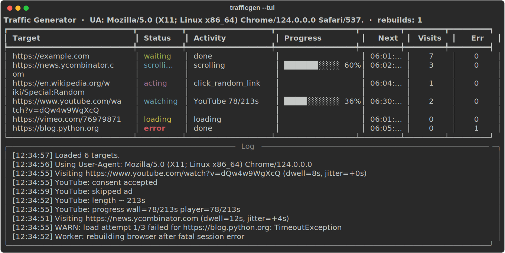

# Traffic Generator

A lightweight Python/[Selenium](https://www.selenium.dev/) traffic generator. It
periodically visits a configurable list of URLs in a headless (or visible)
Chromium browser, with randomized dwell times, optional scrolling, **pluggable
site handlers** (YouTube, Vimeo, Twitch, generic video, infinite scroll),
**per-target action pipelines**, automatic retries/self-healing, and an optional
**live TUI dashboard**.

⚠️ **Disclaimer:** Intended for testing and educational purposes. Use it
responsibly and only on websites you own or have permission to test. Do **not**
use it to manipulate analytics, inflate ad impressions, or violate Terms of
Service.



*The optional `--tui` dashboard: a live table of every target (status, progress,
next run, visit/error counts) plus a scrolling log panel.*

---

## Features

- Configurable URL list (YAML or JSON) with per-target intervals, dwell, jitter
- **Site handlers** chosen automatically by URL (or pinned per target):
  - `youtube` – accepts cookie consent, **skips ads**, plays the video to the end
  - `vimeo`, `twitch`, `generic_video` – play an HTML5 `<video>` to completion
  - `infinite_scroll` – repeatedly scroll a feed to trigger lazy loading
  - `default` – classic scroll/dwell (used when nothing else matches)
- **Per-target actions**: `scroll`, `wait`, `click_random_link`, `random_walk`,
  `search` – composed into a pipeline per target
- **Reliability**: page-load retries with exponential backoff, automatic browser
  rebuild after a crashed session, configurable timeouts and window size
- **TUI dashboard** (`rich`): live table of every target (status, progress,
  next run, visit/error counts) plus a scrolling log panel
- Headless (server-friendly) or headed mode; User-Agent rotation
- Graceful shutdown with `Ctrl+C`; `--once` mode for smoke tests/CI

---

## Requirements

- Python 3.8+
- Chromium or Chrome + matching `chromedriver`
- Dependencies:
  ```bash
  pip install -r requirements.txt
  # or, minimal runtime only:
  pip install selenium pyyaml
  # optional live dashboard:
  pip install rich
  ```
  On Debian/Ubuntu you can also use system packages:
  `apt install chromium chromium-driver python3-yaml`.

---

## Usage

Create a config file (see `urls.yaml` for a fully commented example), then run:

```bash
# Headless (default). Plain stdout logging unless a TTY + rich is detected.
python3 trafficgen.py --config urls.yaml --headless

# Visible browser (needs X11/GUI or xvfb-run):
python3 trafficgen.py --config urls.yaml --headed

# Live dashboard:
python3 trafficgen.py --config urls.yaml --tui

# Visit each target once and exit (smoke/CI):
python3 trafficgen.py --config urls.yaml --once --no-tui
```

### Command-line flags

| Flag | Purpose |
|------|---------|
| `--config PATH` | YAML/JSON config file |
| `--headless` / `--headed` | Headless (default) or visible browser |
| `--tui` / `--no-tui` | Force / disable the live dashboard (default: auto on an interactive TTY when `rich` is installed) |
| `--ignore-cert-errors` | Ignore SSL/TLS certificate errors |
| `--yt-wallclock` | Use wall-clock timing for YouTube finish (auto-enabled in headless) |
| `--max-retries N` | Page-load retry attempts (default 3) |
| `--page-load-timeout S` | Page load timeout in seconds (default 60) |
| `--window-size WxH` | Browser window size (default 1280x800) |
| `--once` | Visit each target once, then exit |
| `--log-file PATH` | Also append log lines to a file |

---

## Configuration

```yaml
defaults:
  dwell_seconds: 8
  interval_seconds: 300
  jitter_seconds: 10
  scroll: true
  page_load_timeout: 60      # optional
  window_size: 1280x800      # optional
  max_retries: 3             # optional

user_agents:
  - Mozilla/5.0 ...

targets:
  # Classic target (scroll/dwell) – unchanged, fully backward compatible
  - url: https://example.com
    interval_seconds: 120
    dwell_seconds: 10

  # Action pipeline
  - url: https://en.wikipedia.org/wiki/Special:Random
    actions:
      - type: scroll
        passes: 2
      - type: click_random_link
        same_origin: true
      - type: wait
        seconds: 4
        jitter: 3

  # Pinned site handler
  - url: https://blog.python.org
    handler: infinite_scroll
    dwell_seconds: 25
```

### Per-target keys

- `url` (required), `interval_seconds`, `dwell_seconds`, `jitter_seconds`, `scroll`
- `handler` – pin a handler by name (`youtube`, `vimeo`, `twitch`,
  `generic_video`, `infinite_scroll`, `default`). Omit to auto-detect by URL.
- `actions` – a list of action steps run during the visit (see below).

### Actions

| Type | Key params |
|------|-----------|
| `scroll` | `passes`, `dwell` |
| `wait` | `seconds`, `jitter` |
| `click_random_link` | `same_origin`, `dwell` |
| `random_walk` | `hops`, `dwell_per_hop`, `same_domain` |
| `search` | `selector`, `query`, `submit`, `dwell` |

If a target has no `actions`, the legacy scroll/dwell behaviour is used, so
existing configs are unaffected.

---

## YouTube handling

YouTube needs special logic, all built into the `youtube` handler:

- Detects YouTube video URLs (`youtube.com/watch`, `youtu.be/...`).
- **Auto-accepts the cookie-consent dialog** (including consent iframes).
- **Detects and skips ads**; ad time is not counted toward progress.
- Plays the video muted, defeating autoplay restrictions and headless
  visibility throttling via JS hacks.
- Finishes when the player reaches the end **or** (default in headless)
  wall-clock time reaches the video duration, so headless playback no longer
  hangs when media is throttled.

---

## Architecture

The code is a small package so the pure logic is unit-testable without a browser:

```
trafficgen.py            # entry-point shim
trafficgen/
  config.py  urlmatch.py  state.py  scheduler.py  driver.py
  logging_util.py  browser_helpers.py  cli.py  tui.py
  handlers/  (youtube, vimeo, twitch, generic_video, infinite_scroll, default)
  actions/   (scroll, wait, click_random_link, random_walk, search)
```

A single worker thread owns the browser and the scheduler; in TUI mode the main
thread renders the dashboard from a thread-safe state snapshot.

---

## Tests

```bash
pip install pytest
pytest                 # pure unit tests (no browser)
pytest -m selenium     # optional end-to-end smoke test (needs a real browser)
```

---

## License

MIT License – feel free to modify and adapt for your own testing setups.
